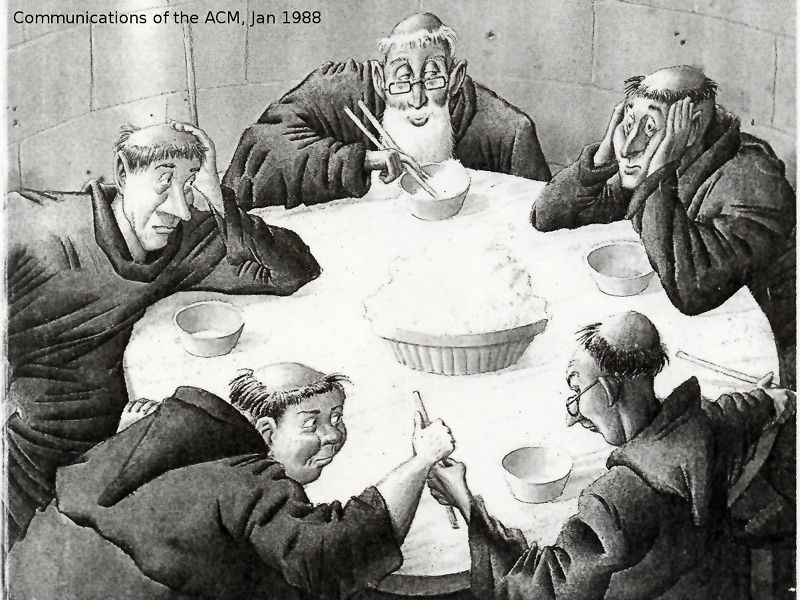
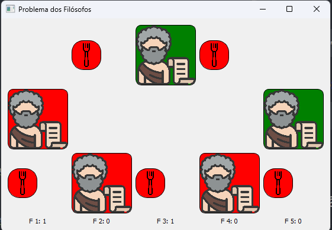

# Problema dos Filósofos e Solução com Semáforos

# Descrição:

---

## 1. Problema do Filósofo:
O problema dos filósofos é um clássico da computação que busca ilustrar questões de concorrência e sincronização em sistemas operacionais. Ele propõe uma situação onde cinco filósofos estão sentados ao redor de uma mesa circular, onde cada um alterna entre os estados de pensar e comer. Entre cada filósofo, há um único garfo, e para um filósofo conseguir comer, ele precisa dos dois garfos ao lado.



O problema principal é como permitir que cada filósofo possa comer e pensar sem conflitos e evitar condições como:

Deadlock: todos os filósofos pegam o garfo à sua esquerda ao mesmo tempo e ficam esperando o garfo à direita, travando o sistema.
Starvation: um ou mais filósofos podem ficar esperando indefinidamente, sem nunca conseguirem comer.
## 2. Solução Adotada (Semáforo):
Para resolver o problema de forma controlada, adotamos semaforos para gerenciar o acesso aos garfos. Cada garfo é representado por um semáforo, que permite o acesso exclusivo a um filósofo por vez. A estratégia para pegar e soltar os garfos envolve:

1. Cada filósofo tenta pegar o garfo à sua esquerda e depois o garfo à sua direita (ou vice-versa, dependendo do ID do filósofo). A alternância garante que nem todos os filósofos tentem pegar os garfos na mesma ordem.
2. Ao terminar de comer, o filósofo libera os dois garfos, permitindo que outros possam acessá-los.

### Para implementar, usamos:

- `Semáforo` para cada garfo: controla o acesso ao recurso (garfo) de modo que apenas um filósofo possa usá-lo de cada vez.

- `Mutex (lock)` para controlar o acesso as variáveis que atualizam a exibição da interface:
  - contador de quantas vezes cada filosofo comeu;
  - registro se o garfo está parado ou em uso;
  - registro se o filosofo está comendo ou esperando;

## 3. Vantagens Dessa Solução:
A solução com semáforos oferece algumas vantagens para sincronização em um problema de recursos compartilhados:

- Evita a Corrida por Recursos: ao permitir apenas um filósofo de cada vez em cada garfo, evitamos conflitos de concorrência, onde múltiplos filósofos poderiam tentar acessar o mesmo recurso.
- Controle Simples: o uso de semáforos e mutexes mantém a estrutura simples, controlando o acesso com bloqueios específicos que se adequam ao modelo do problema.
- Flexível para Escalabilidade: a solução pode ser escalada para mais filósofos e garfos com modificações mínimas, desde que cada garfo seja representado por um semáforo.

## 4. Desvantagens Dessa Solução:
Apesar de prática, a solução tem algumas desvantagens que podem ser mitigadas, mas ainda representam desafios importantes.

### 4.1. Deadlock;
O deadlock ocorre se todos os filósofos pegarem o garfo à sua esquerda ao mesmo tempo e ficarem esperando o garfo à direita. Para evitar esse problema, utilizamos a técnica de ordenação alternada dos garfos:

1. Filósofos com `ID par` pegam o garfo à esquerda primeiro;
2.  Filósofos com `ID ímpar` pegam o garfo à direita primeiro.

Isso evita o deadlock porque impede que todos os filósofos bloqueiem o garfo à esquerda e fiquem esperando indefinidamente o proximo garfo;

### 4.2. Acesso Desigual pelos Filósofos aos Recursos:
Com essa estratégia, pode haver acesso desigual aos recursos, pois a ordem de aquisição de garfos favorece determinados filósofos em detrimento de outros. Esse é um problema conhecido como `starvation`, onde alguns filósofos podem conseguir comer mais frequentemente do que outros, dependendo do momento e da sequência de acesso aos garfos.

Um paliativo adotado foi colocar um `sleep` de 1 segundo para assim que o filosofo para de comer e ter um pequeno tempo filosofando, isso não é o ideal e não resolve o problema completamente, mas nos testes executados deixou o desvio padrão de tempo de alimentação dos filosofos muito pequeno.

# Intalação e execução:

---

## Intalação:
```python
pip install -r requirements.txt
``` 

## Execução:
``` python
python main.py
```

## Interface:

